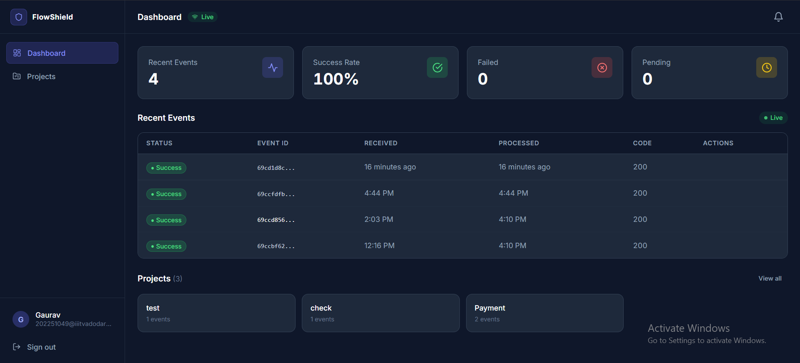
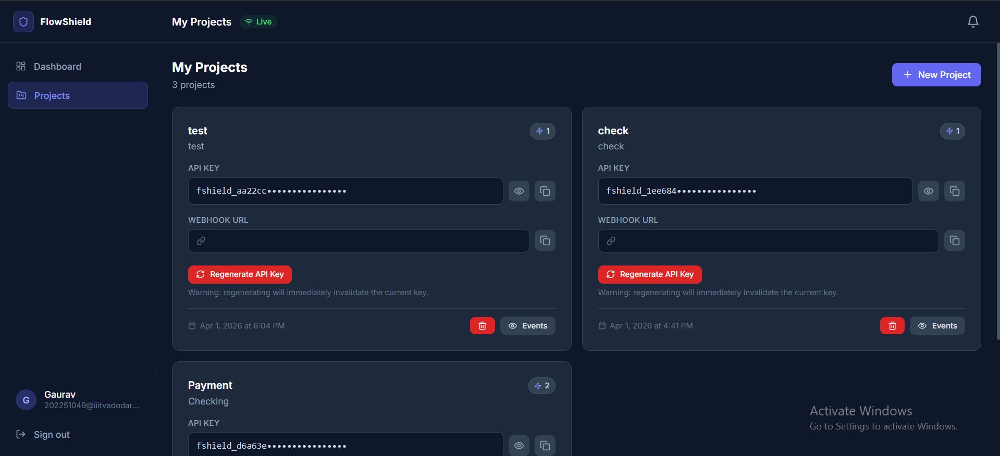
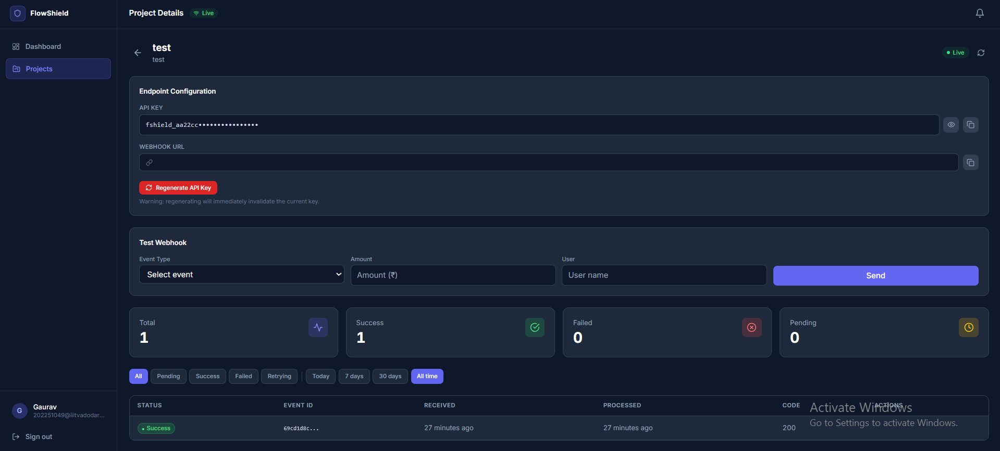

# FlowShield ⚡

> Webhook management and API protection engine — reliable event delivery, real-time monitoring, and fault-tolerant processing.

---

## ✨ Features

- 🔄 Async webhook processing via Redis-backed BullMQ queue
- 🔁 Automatic retry with exponential backoff + Dead Letter Queue
- 📡 Real-time dashboard updates via Socket.io WebSockets
- 🔐 JWT authentication + per-project API key validation
- 🛡 Rate limiting, helmet security, and input validation
- 📊 Live event stats — success rate, failures, pending count
- 🧾 Full audit log with payload inspector and retry controls

---

## 🛠 Tech Stack

**Frontend**
- React 18, Vite, Tailwind CSS v3
- Zustand (state), React Hook Form + Zod (validation)
- Socket.io-client, Axios, React Router v6

**Backend**
- Node.js 20, Express.js 4
- MongoDB + Mongoose 8
- Redis + BullMQ 5
- Socket.io 4, JWT, bcryptjs, Winston

---

## 📂 Structure
```bash
flowshield/
├── frontend/
│   ├── src/
│   │   ├── api/           # Axios instance + API calls
│   │   ├── components/    # UI + layout + feature components
│   │   ├── hooks/         # useSocket, useAuth, useToast
│   │   ├── pages/         # Dashboard, Projects, Auth
│   │   ├── store/         # Zustand stores (auth, projects, events)
│   │   └── utils/         # Formatters, validators, constants
│   └── package.json
│
└── backend/
    ├── src/
    │   ├── config/        # DB, Redis, Queue, Socket, Logger
    │   ├── controllers/   # Auth, Projects, Events, Webhooks
    │   ├── middleware/     # Auth, API key, Rate limiter, Error handler
    │   ├── models/        # User, Project, Event schemas
    │   ├── routes/        # All route definitions
    │   ├── services/      # Business logic + queue + worker
    │   └── utils/         # AppError, asyncHandler, apiResponse
    ├── server.js
    ├── worker.js
    └── package.json
```

---

## ⚙️ Setup
```bash
# Clone the repo
git clone https://github.com/GJBarhate/flowshield.git
cd flowshield

# Install dependencies
cd backend && npm install
cd ../frontend && npm install

# Start backend (terminal 1)
cd backend && npm run dev

# Start frontend (terminal 2)
cd frontend && npm run dev
```

> Requires: Node.js 20+, MongoDB, Redis running locally.

---

## 🔐 Environment Variables

**`backend/.env`**
```env
PORT=5000
NODE_ENV=development

MONGODB_URI=mongodb://localhost:27017/flowshield

REDIS_HOST=localhost
REDIS_PORT=6379
REDIS_PASSWORD=

JWT_SECRET=your-super-secret-key-minimum-32-chars
JWT_EXPIRES_IN=7d

QUEUE_NAME=flowshield-webhooks
MAX_JOB_ATTEMPTS=3
JOB_BACKOFF_DELAY=5000

ALLOWED_ORIGINS=http://localhost:5173
```

**`frontend/.env`**
```env
VITE_API_URL=http://localhost:5000/api
VITE_SOCKET_URL=http://localhost:5000
```

---

## 📸 Screenshots

### Dashboard


### Project Detail


### Event Inspector

---

## 📡 API Reference

| Method | Endpoint | Description |
|--------|----------|-------------|
| `POST` | `/api/auth/register` | Register user |
| `POST` | `/api/auth/login` | Login + get JWT |
| `GET` | `/api/projects` | List user projects |
| `POST` | `/api/projects` | Create project + API key |
| `POST` | `/api/webhook/:projectId` | Receive webhook event |
| `GET` | `/api/events/:projectId` | List events (paginated) |
| `POST` | `/api/events/:eventId/retry` | Retry failed event |

> Webhook endpoints require `x-api-key` header. All other routes require `Authorization: Bearer <token>`.

---

## 🚀 Deploy

- **Frontend** — Vercel: connect repo, set `VITE_API_URL` in project settings.
- **Backend** — Railway / Render: set all `.env` variables, run `npm start` and `npm run worker` as separate services.

---

## 👤 Author

**Your Name**  
Full-stack developer — building reliable infrastructure tooling.  
[GitHub](https://github.com/GJBarhate) · [LinkedIn](www.linkedin.com/in/gaurav-barhate-056175271)

---
